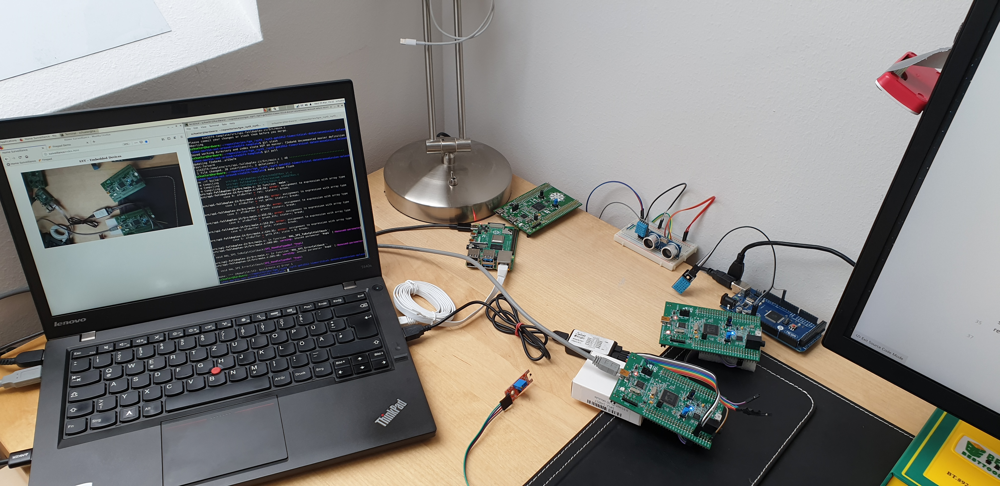

# Hardware Station *SYT Embedded-Devices*

Das SYT Labor ist über den Zeitraum des *COVID-19 Lockdowns* online erreichbar. Diese Hilfestellung ist auch als File direkt auf dem Desktop der Hardware-Station abgelegt. Hier ein kleiner Vorgeschmack der *"Hardware-Station"*: 


## Verbindungsaufbau
Über den Browser kann unter [hardware.meschareth.net](https://hardware.meschareth.net) die Oberfläche zur Anmeldung erreicht werden. Es gibt einen Account **schueler** zur direkten Bearbeitung, der auf Grund der ausgelasteten Internet-Connection nur auf eine einzelne Verbindung begrenzt ist. Die bis zu fünf Beobachter können sich mit dem Benutzer **readonly** anmelden. Hier die Credentials:
```
schueler :: window_toxin8signal
readonly :: Murder6Writ4Bride
```
Um einfach Daten in die zur Verfügung gestellte Umgebung einbinden zu können, bietet sich das eigene Github-Repository zur Aufgabenbearbeitung an. Um jedoch schnell Informationen in die Zwischenablage einbinden zu können ist ein Online-Kolaborations-Editor unter [firepad.io](https://demo.firepad.io/#Se25K9FDmt) in Verwendung. Die Hardware wird von einem RaspberryPi Zero W *"beobachtet"* und ist nur intern unter [http://surveillance/](http://surveillance/index.html) erreichbar. Beide oben genannten Links sind im Browser gespeichert (Home Surveillance, Firepad) und können dort abgerufen werden.

## Start und Ende einer Session
Bitte zum Start sich auf dem eigenen Rechner mit Firepad verbinden und den zufällig vergebenen Benutzernamen (z.B. User 440) auf seinen eigenen Namen ausbessern. Dies erleichtert die Hilfestellung und ermöglicht eine einfachere Zuordnung der gerade aktiven Session zu einer Person.

Der Code für die Hardware kann entweder in Firepad oder per Userrepository (bitte Verzeichnisstruktur beachten) hochgeladen werden. Bitte nicht auf diesem System unnötig lange debuggen, da dies die aktive Zeit für andere einschränkt!

Nach dem endgültigen Beenden der Verbindung (zwischenzeitliches Freigeben ist erwünscht) nach Abgabe oder Ende der Laboreinheit sind hochgeladene Files wieder zu entfernen und auch Firepad wieder zu verlassen. Nicht vergessen Änderungen zu pushen bzw. Code wieder auf das eigene System zurück zu kopieren.

## System
Das bereitgestellte Betriebssystem ist ein aktuelles **Debian Testing** mit einem **5.4.0-4-amd64** Kernel auf einem **Lenovo ThinkPad T440s** mit 12 GB RAM und einer i5-4200U CPU. Der zu verwendete Benutzer im System ist **schueler** mit dem selben Passwort.

## Bereitgestellte Hardware
* **Arduino ATMega2560** Mikrocontroller zur einfachen Anbindung von Sensoren
* **STM32F4-Discovery** Das Discovery Board kann über die *st-link Tools* geflasht werden
* **RaspberryPi 4 Model B** Dieser ist über `ssh raspi` intern erreichbar
* **Salea-Logic Analyzer 24MHz 8CH** Zur Analyse der Kommunikationsschnittstellen (z.B. SPI)
* **DHT11** Luftfeuchtigkeit- und Temperatursensor
* **KY-028** Temperatur Switch Sensor
* **HC-SR04** Ultraschall-Abstandsensor
* **KY-018** Foto LDR Widerstand

Das AZ-Delivery Sensorkit [2] ist vorhanden und einzelne Sensoren aus diesem Kit können auf Wunsch auch eingebunden werden.

## Verzeichnisstruktur
Hier eine Übersicht der zum Einsatz kommenden Verzeichnisse:

|Directory|Info|
|:--|:--|
|`/home/schueler/bin/arduino`| Arduino IDE |
|`/home/schueler/bin/logic`| aktueller Salea Logicanalyzer |
|`/home/schueler/repositories/stlink`| "Open source version of the STMicroelectronics Stlink Tools" |
|`/home/schueler/repositories/stm32f4-template`| "Template project for the STM32F4Discovery Board" |
|`/home/schueler/repositories/tgm_/syt5_`| Root Directory für die Abgaberepositories der 5xHIT |
|`/home/schueler/repositories/tgm_/syt4_`| Root Directory für die Abgaberepositories der 4xHIT |
|`/home/schueler/opt/STM32Cube_FW_F4_V1.24.1`| Toolchain für die STM32F4 Umgebung mit Dokumentation |
|`/home/schueler/opt/STM32Cube_FW_F4_V1.24.1/Projects/STM32F4-Discovery/Examples`| STM32F4 Examples |

Die wichtigsten Programme haben auch einen Launcher am Desktop.

## FaQ
Hier werden Antworten auf immer wieder gestellte Fragen aktualisiert beantwortet:

#### *Wie kann ich mein Passwort von Github speichern, damit ich es nicht immer wieder eingeben muss?*  
Dies kann im geclonten (https) Repository mit dem Befehl `git config credential.helper 'cache --timeout=300'` erfolgen. In diesem Beispiel sind Benutzername und Passwort für 5 Minuten gespeichert [1].
Man kann aber auch über ssh geclonte Repositories kurzfristig einen neuen ssh-key erstellen und diesen in Github bei seinem Account einbinden. Bitte nicht vergessen, diesen nach Beendigung der Verbindung wieder zu deaktivieren!


#### *Was genau macht das `DEVICE=` beim flashen des Mikrocontrollers?*
Es sind beide STM32F4-Discovery Boards am Rechner angeschlossen. Damit nicht immer die Boards herum gehängt werden müssen, ist dieses DEVICE gedacht. Dies hat sonst keine Auswirkungen auf die Programmierung! Im `stm32f4-template` kann mit dem Befehl `make clean flash DEVICE=slave` das entsprechende Discovery-Board (siehe Kamera) programmiert werden. Die Anpassung ist erst vor Kurzem gepushed worden, daher bitte überprüfen, ob dies schon im eigenen `Makefile` vorhanden ist.


#### *Ist die Library "xyz" schon auf dem Rechner installiert?*
Es sind alle notwendigen Elemente zur Ausführung und Programmierung vorhanden. Von der Toolchain unabhängige Bibliotheken sind nicht vorhanden und müssen im eigenen Repository eingebunden werden (z.B. Libraries for STM32Fxxx series by Tilen Majerle).  

Vorsicht bei der Verwendung von Libraries mit gleichen Definitionen (z.B. DHT.h), diese können zu Fehlern beim Kompilieren und Linken führen, da nicht eindeutig ist welche Implementierung zum Builden herangezogen werden soll.


#### *Wie geht das? Das funktioniert nicht! Wo bitte schön ist alles?*  
Für dieses *mimimi* habe ich leider auch keine Lösung! Bitte bei Problemen oder Fragen explizit die Schwierigkeit beschreiben und im jeweiligen Channel in Teams online stellen. Bei komplexeren Anfragen kann ich natürlich direkt und unterstützend eingreifen.

## Resources
* [1] "git-credential-store" git-scm [online](https://git-scm.com/docs/git-credential-store)
* [2] "AZ-Delivery 35 in 1 Arduino Sensorenkit" [online](https://www.az-delivery.de/products/35-in-1-arduino-zubehor-kit?_pos=2&_sid=6f2970640&_ss=r)
